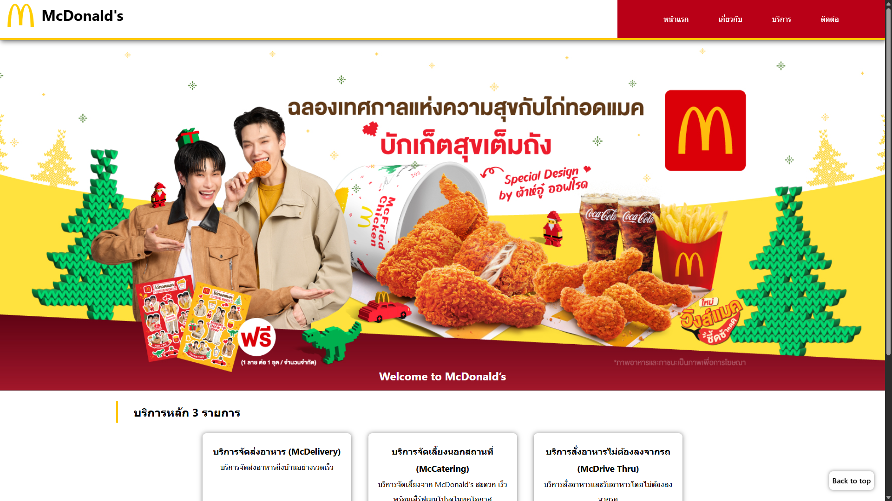
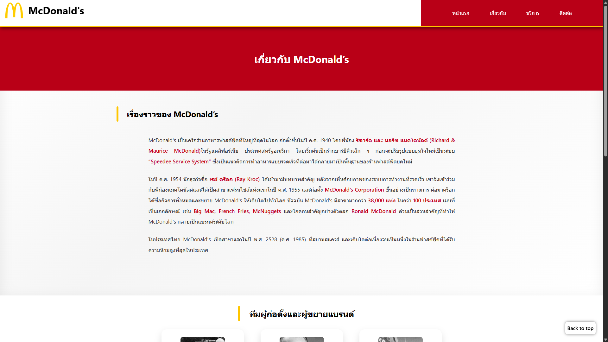
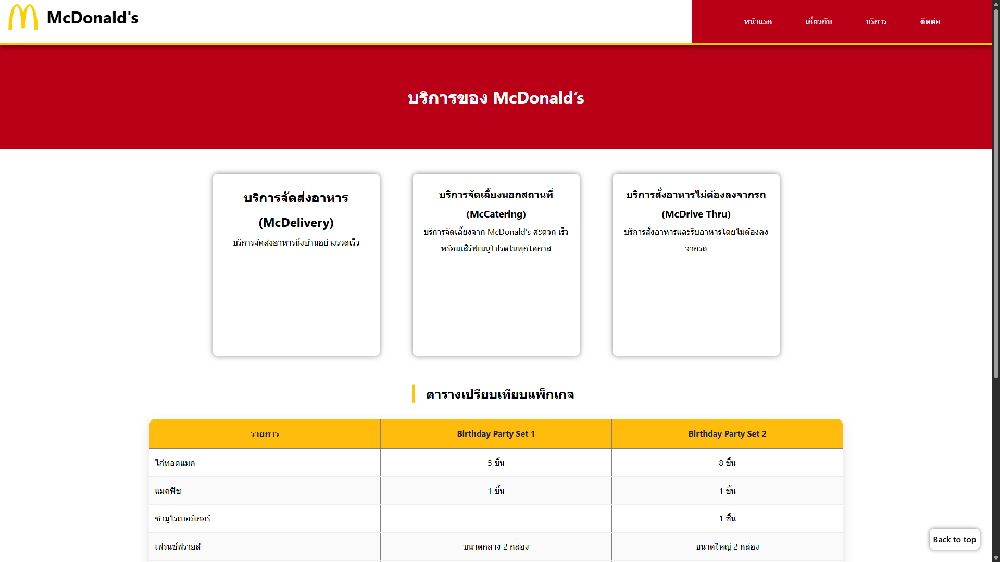
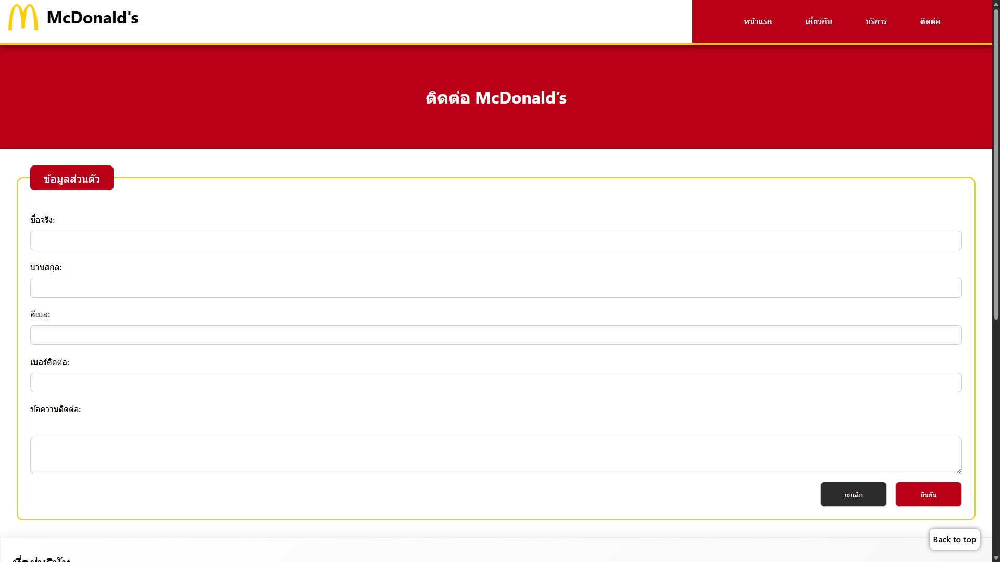

# My Business Web

## คำอธิบายโปรเจค

- เว็ปไซต์ธุรกิจของ McDonald's
- เพื่อทำความเข้าใจโครงสร้างเว็บเบื้องต้น การสร้างหน้าเว็บหลายหน้า และการลิงก์ระหว่างหน้า
- สร้างขึ้นเพื่อฝึกการใช้ HTML Semantic (โดยไม่ใช้ CSS หรือ JavaScript)
- เรียนรู้การจัดหน้าเว็บ การลิงก์ระหว่างหน้า และการใช้องค์ประกอบพื้นฐานของ HTML

## ไฟล์ที่สร้าง

- **index.html** - หน้าแรกของเว็บไซต์ McDonald's
- **about.html** - หน้าข้อมูลเกี่ยวกับ McDonald's ประวัติ ความเป็นมา และพันธกิจของแบรนด์
- **services.html** - หน้ารายละเอียดบริการต่างๆ ของ McDonald's
- **contact.html** - หน้าติดต่อเรา ฟอร์มติดต่อออนไลน์ ที่อยู่สาขา แผนที่

## All pages with direct links

- [หน้าแรก /index.html](index.html)
  
  หลังเพิ่ม css
  
- [เกี่ยวกับ /about.html](about.html)
  
  หลังเพิ่ม css
  
- [บริการ services.html](services.html)
  
  หลังเพิ่ม css
  
- [ติดต่อ /contact.html](index.html)
  
  หลังเพิ่ม css
  

## How to Run

1. เปิด index.html in browser
2. หรือเปิดด้วย Live Server in VS Code

## CSS Improvements

หลังจากสร้างโครงสร้างเว็บไซต์ด้วย HTML Semantic แล้ว ได้มีการพัฒนาเว็บไซต์เพิ่มเติมด้วย CSS เพื่อปรับปรุงความสวยงาม ความเป็นระเบียบ และประสบการณ์ผู้ใช้ โดยมีรายละเอียดดังนี้

---

### 1. Reset & Default Styles

- ใช้ CSS Reset (`* { margin: 0; padding: 0; box-sizing: border-box; }`)
- กำหนด font หลักให้เป็น system font เพื่อความเหมาะสมกับทุกอุปกรณ์
- ตั้งค่า `line-height` เพื่อให้อ่านเนื้อหาได้ง่ายขึ้น

---

### 2. CSS Variables

- ใช้ `:root` เพื่อกำหนดตัวแปรสีของเว็บไซต์
- แยกสีหลัก สีรอง สีพื้นหลัง และสีตัวอักษร
- ช่วยให้การจัดการธีมสีทั้งเว็บไซต์เป็นระบบและแก้ไขได้ง่าย

---

### 3. Typography

- ปรับขนาดตัวอักษรของ `h1, h2, h3` ให้เหมาะสมตามลำดับความสำคัญ
- กำหนดสีข้อความให้สอดคล้องกับธีมของเว็บไซต์
- ปรับ `line-height` ของ `p` เพื่อเพิ่มความอ่านง่าย

---

### 4. Header & Navigation

- ใช้ `position: sticky` เพื่อให้ Header ติดด้านบนขณะเลื่อนหน้าเว็บ
- จัด layout ของ Header และ Navigation ด้วย Flexbox
- เพิ่ม hover effect ให้เมนูนำทาง
- ปรับความกว้างของ Navigation ให้เหมาะสมกับหน้าจอ

---

### 5. Hero Section

- สร้าง Hero section พร้อมภาพพื้นหลัง
- ใช้ pseudo-element `::before` สำหรับใส่ background image
- จัดข้อความให้อยู่กึ่งกลางและมองเห็นชัดเจน

---

### 6. Card & Services Layout

- ออกแบบ Card สำหรับแสดงบริการต่าง ๆ
- ใช้ Flexbox และ `flex-wrap` เพื่อจัดการ layout
- เพิ่ม shadow, border-radius และ animation
- เพิ่ม hover effect เพื่อเพิ่มความน่าสนใจ

---

### 7. Table Styling

- ออกแบบตารางเปรียบเทียบบริการ
- ใช้ `border-collapse` และ shadow เพื่อความเป็นระเบียบ
- เพิ่มสีสลับในแต่ละแถว (zebra striping)
- เพิ่ม hover effect ในแถวของตาราง

---

### 8. About Page Enhancements

- ปรับ section ประวัติ (History) ให้มีเส้น accent และ background
- ออกแบบ Team Members ด้วย Grid layout
- เพิ่ม card animation เมื่อ hover
- ปรับ Mission & Vision ให้ดูโดดเด่นด้วย shadow และ gradient

---

### 9. Contact Page Styling

- ออกแบบ Contact Form ด้วย fieldset และ legend
- ปรับ input และ textarea ให้มี focus effect
- ออกแบบปุ่ม submit และ reset พร้อม hover animation
- ปรับ Google Map iframe ให้ดูเป็น card และมีเงา

---

### 10. Buttons & Interaction

- เพิ่มปุ่ม Back to Top และ Back to Home
- ใช้ transition และ transform เพื่อเพิ่มความลื่นไหล
- เพิ่ม hover และ active state ให้กับปุ่มและ card

---

### 11. Responsive Design

- ใช้ Media Queries รองรับการแสดงผลหลายขนาดหน้าจอ
- ปรับ layout สำหรับ Tablet และ Mobile
- เปลี่ยน Navigation เป็นแนวตั้งในหน้าจอเล็ก
- ปรับขนาดตัวอักษรและองค์ประกอบให้เหมาะสมกับ Mobile

---

### 12. Learning Outcome

- เข้าใจการแยกหน้าที่ระหว่าง HTML (โครงสร้าง) และ CSS (การออกแบบ)
- ฝึกใช้ Flexbox, Grid และ Media Queries
- เรียนรู้การออกแบบเว็บไซต์ให้ Responsive
- พัฒนา UI โดยไม่ใช้ JavaScript
