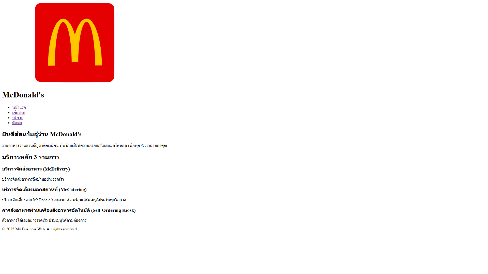
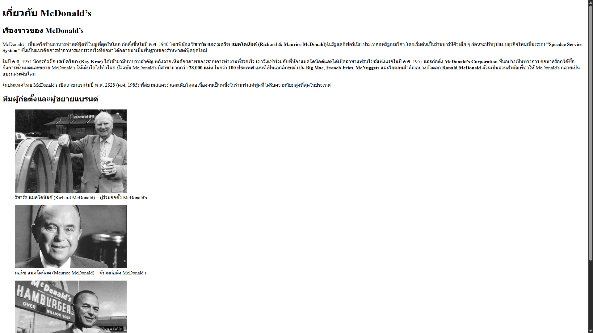
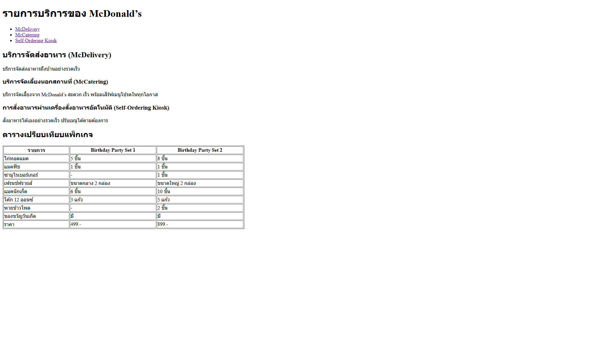
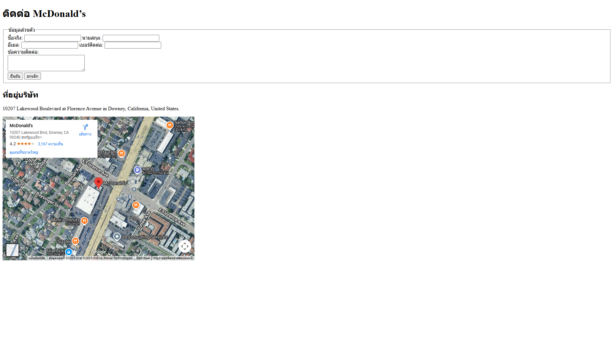

# My Business Web

## คำอธิบายโปรเจค

- เว็ปไซต์ธุรกิจของ McDonald's
- เพื่อทำความเข้าใจโครงสร้างเว็บเบื้องต้น การสร้างหน้าเว็บหลายหน้า และการลิงก์ระหว่างหน้า
- สร้างขึ้นเพื่อฝึกการใช้ HTML Semantic (โดยไม่ใช้ CSS หรือ JavaScript)
- เรียนรู้การจัดหน้าเว็บ การลิงก์ระหว่างหน้า และการใช้องค์ประกอบพื้นฐานของ HTML

## ไฟล์ที่สร้าง

- **index.html** - หน้าแรกของเว็บไซต์ McDonald's
- **about.html** - หน้าข้อมูลเกี่ยวกับ McDonald's ประวัติ ความเป็นมา และพันธกิจของแบรนด์
- **services.html** - หน้ารายละเอียดบริการต่างๆ ของ McDonald's
- **contact.html** - หน้าติดต่อเรา ฟอร์มติดต่อออนไลน์ ที่อยู่สาขา แผนที่

## All pages with direct links

- [หน้าแรก /index.html](index.html)
  
- [เกี่ยวกับ /about.html](about.html)
  
- [บริการ services.html](services.html)
  
- [ติดต่อ /contact.html](index.html)
  

## How to Run

1. เปิด index.html in browser
2. หรือเปิดด้วย Live Server in VS Code
